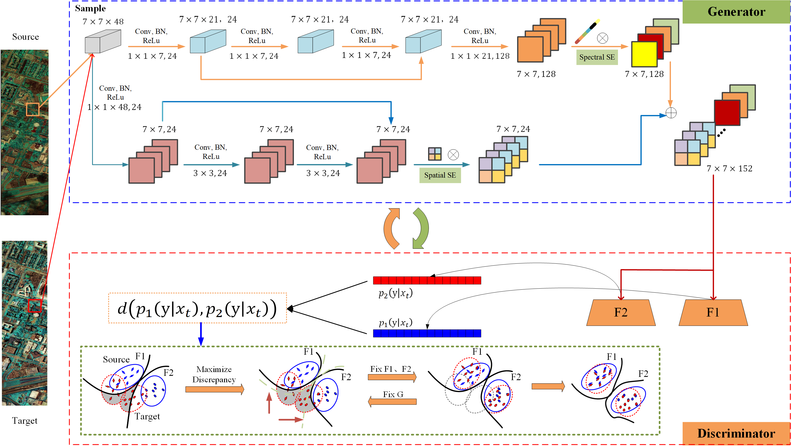

# TAADA
Two-Branch Attention Adversarial Domain Adaptation Network for Hyperspectral Image Classification

Paper web page: [Two-Branch Attention Adversarial Domain Adaptation Network for Hyperspectral Image Classification]([https://ieeexplore.ieee.org/document/9924236]).

  

## Abstract
Recent studies have shown that deep domain adaptation (DA) techniques have good performance on cross-domain hyperspectral image (HSI) classification problems. However, most existing deep HSI DA approaches directly use deep networks to extract features from the data, which ignores the detailed information of HSI in spectral and spatial dimensions. To effectively exploit the spectral–spatial joint information for DA of HSIs, we propose a two-branch attention adversarial DA (TAADA) network in this article. In the TAADA network, a twobranch feature extraction (TBFE) subnetwork is first designed as a generator to extract the attention-based spectral–spatial features. Then, a discriminator based on two classifiers with the multilayer FC-BN-ReLU-Dropout structure is constructed. Based on adversarial learning between the generator and the discriminator, the ability of discriminative feature extraction and cross-domain classification is improved simultaneously. Finally, the TAADA network can adjust the distribution between the source and target domains and extract domain-invariant features. Experimental results on three cross scene HSI classification tasks show that our proposed TAADA outperforms some existing DA methods.

## Paper

Please cite our paper if you find the code or dataset useful for your research.

@ARTICLE{9924236,
  author={Huang, Yi and Peng, Jiangtao and Sun, Weiwei and Chen, Na and Du, Qian and Ning, Yujie and Su, Han},
  journal={IEEE Transactions on Geoscience and Remote Sensing}, 
  title={Two-Branch Attention Adversarial Domain Adaptation Network for Hyperspectral Image Classification}, 
  year={2022},
  volume={60},
  number={},
  pages={1-13},
  keywords={Feature extraction;Task analysis;Generators;Adversarial machine learning;Training;Sun;Deep learning;Adversarial network;domain adaptation (DA);hyperspectral image (HSI);two-branch},
  doi={10.1109/TGRS.2022.3215677}}
